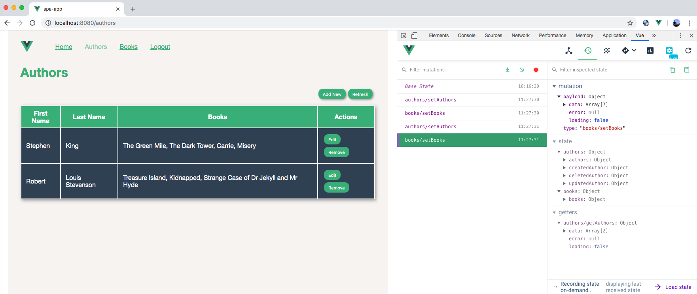
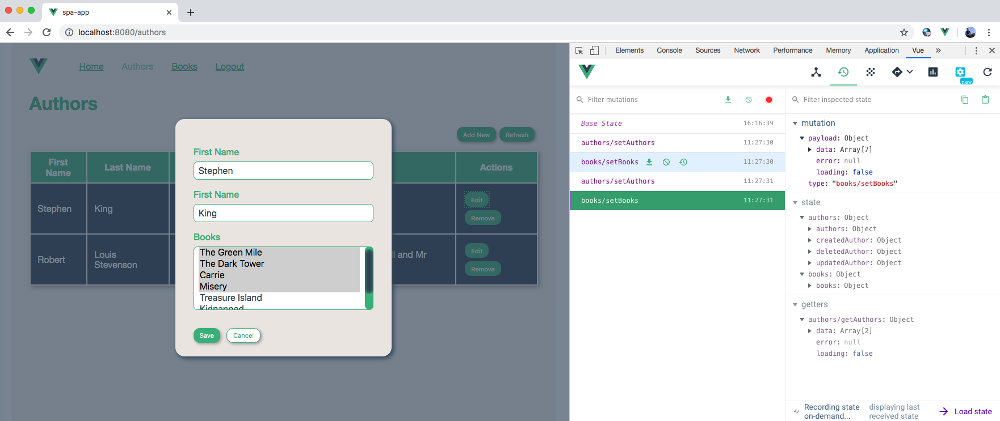

# Test Vue App (Authors-Books)
>Test SPA based on [Vue](https://vuejs.org), [Vue-Router](https://router.vuejs.org), [Vuex](https://vuex.vuejs.org), [Fontawesome](https://fontawesome.com/how-to-use/on-the-web/using-with/vuejs), [Styleguidist](https://vue-styleguidist.github.io) and [Jest](https://vue-test-utils.vuejs.org/guides/testing-single-file-components-with-jest.html) 





## Project setup
```
npm install
```

### Compiles and hot-reloads for development
```
npm run serve
```

### Compiles and minifies for production
```
npm run build
```

### Run your tests
```
npm run test
```

### Lints and fixes files
```
npm run lint
```

### Run interactive documentation
```
npm run styleguide
```

### Customize configuration
See [Configuration Reference](https://cli.vuejs.org/config/).
